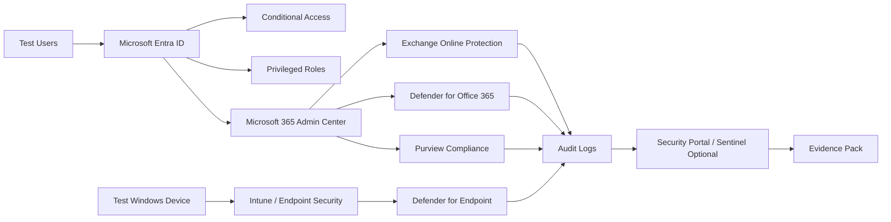

# Lab Architecture

This document defines the target lab architecture for the Microsoft 365 Security Hardening Lab.

## Architecture goals

The lab should be:

- Reproducible: a new user can rebuild it from a clean tenant.
- Safe: hardening changes are tested in a non-production tenant first.
- Evidence-friendly: every control produces a screenshot, export, report, or script output.
- Rollback-aware: risky settings have a documented recovery path.
- Licence-aware: modules clearly state which features depend on higher licensing.

## High-level architecture



## Tenant components

| Component | Purpose | Example evidence |
| --- | --- | --- |
| Microsoft Entra ID | Identity, users, groups, roles, authentication methods | User list, role assignment export, MFA registration report |
| Conditional Access | Authentication and access control policy enforcement | Policy export, report-only results, sign-in log result |
| Microsoft 365 Admin Center | Core tenant settings and admin roles | Settings screenshots, admin role review |
| Exchange Online Protection | Baseline email protection | Anti-spam, anti-malware, anti-phishing policy exports |
| Defender for Office 365 | Advanced email and collaboration protection | Safe Links, Safe Attachments, campaign or explorer evidence |
| Intune / Endpoint Security | Device compliance and endpoint baselines | Compliance policy export, security baseline assignment |
| Defender for Endpoint | Endpoint detection and response | Device onboarding status, alert simulation evidence |
| Microsoft Purview | DLP, sensitivity labels, audit, retention | DLP policy export, sensitivity label publication, audit settings |
| Sentinel or SIEM optional | Centralised monitoring and alerting | Connector status, analytic rule list, incident queue |

## Suggested lab users

| User | Role | Purpose |
| --- | --- | --- |
| `global.admin.lab` | Emergency setup administrator | Used for initial configuration only |
| `breakglass.one` | Emergency access account | Excluded from normal CA but monitored and reviewed |
| `breakglass.two` | Backup emergency access account | Secondary recovery path |
| `security.admin` | Security administrator | Security portal and Defender configuration |
| `compliance.admin` | Compliance administrator | Purview and DLP configuration |
| `standard.user1` | Standard user | User impact testing |
| `standard.user2` | Standard user | Group and policy assignment testing |
| `vip.user` | Sensitive user persona | Higher-risk access and alert scenario testing |

## Suggested groups

| Group | Purpose |
| --- | --- |
| `SG-CA-MFA-AllUsers-Pilot` | Pilot scope for MFA Conditional Access |
| `SG-CA-Excluded-EmergencyAccess` | Emergency access exclusions |
| `SG-Endpoint-Windows-Pilot` | Test devices for endpoint policies |
| `SG-DLP-PilotUsers` | DLP and sensitivity label pilot users |
| `SG-Security-Admins` | Security administrator assignment group |
| `SG-Compliance-Admins` | Compliance administrator assignment group |

## Lab zones

| Zone | Description | Risk level |
| --- | --- | --- |
| Baseline | Capture tenant state before changes | Low |
| Pilot | Apply policies to a limited test group | Medium |
| Enforcement | Move selected policies from report-only to on | High |
| Verification | Confirm hardening state and collect evidence | Low |
| Rollback | Restore access or undo changes if required | High |

## Evidence outputs

At the end of the lab, create an evidence pack with:

```text
evidence/
├── 01-baseline/
├── 02-identity-and-access/
├── 03-email-security/
├── 04-endpoint-security/
├── 05-data-protection/
├── 06-logging-and-monitoring/
├── 07-verification-script-output/
└── 08-rollback-test/
```

## Architecture assumptions

- This is a lab-first architecture, not a production reference architecture.
- Licensing and feature availability may vary by tenant, region, subscription, and trial state.
- Some features require time to propagate before verification results appear.
- Portal names and navigation paths may change, so verification scripts and exported evidence are preferred where possible.

## Lockout prevention design

Before enforcing Conditional Access or privileged role restrictions:

1. Create two emergency access accounts.
2. Store their credentials securely.
3. Exclude them from normal Conditional Access policies.
4. Monitor and review them separately.
5. Confirm both accounts can sign in before enabling enforcement.
6. Keep one active admin session open during changes.
This lab is designed to simulate a real-world enterprise Microsoft 365 environment with modern security controls applied. It focuses on identity, email, endpoints, data protection, and SIEM monitoring.

**Lab Components**

The environment includes:

1. Identity & Access Management
  * Azure AD (Entra ID) tenant
  * Conditional Access policies
  * MFA enforcement
  * Break-glass emergency account
  * Role-Based Access Control (RBAC)

2. Email & Collaboration Security
  * Exchange Online
  * Defender for Office 365
  * Anti-spam & anti-phishing (EOP & MDO)
  * Safe Links & Safe Attachments

3. Endpoint Security
  * Microsoft Defender for Endpoint
  * ASR rules
  * Defender AV baseline
  * Threat & Vulnerability Management (TVM)

4. Data Loss Prevention & Compliance
  * Sensitivity labels
  * DLP policies
  * Insider Risk Management (optional)

5. Monitoring & Threat Detection
  * Microsoft 365 Defender unified incidents
  * Sentinel (optional)
  * KQL-based threat hunting

**High-Level Architecture (Text Diagram)**
```
                ┌─────────────────────────┐
                │     Azure AD / Entra    │
                │   - Identities          │
                │   - CA policies         │
                └───────────┬─────────────┘
                            │
        ┌───────────────────┼────────────────────┐
        │                   │                    │
┌────────────────┐   ┌──────────────┐   ┌──────────────────┐
│  Exchange      │   │ SharePoint/  │   │ Endpoints:       │
│  Online        │   │ OneDrive     │   │ Win10/11 Clients │
│  MDO/EOP       │   │ Labels/DLP   │   │ MDE Agent        │
└────────────────┘   └──────────────┘   └──────────────────┘
        │                   │                     │
        └───────────────────┼─────────────────────┘
                            │
                            ▼
                 ┌────────────────────┐
                 │  M365 Defender     │
                 │  - Incidents       │
                 │  - Alerts          │
                 └─────────┬──────────┘
                           │
                           ▼
                 ┌────────────────────┐
                 │ Sentinel (Optional)│
                 │ KQL Hunting        │
                 └────────────────────┘
```

